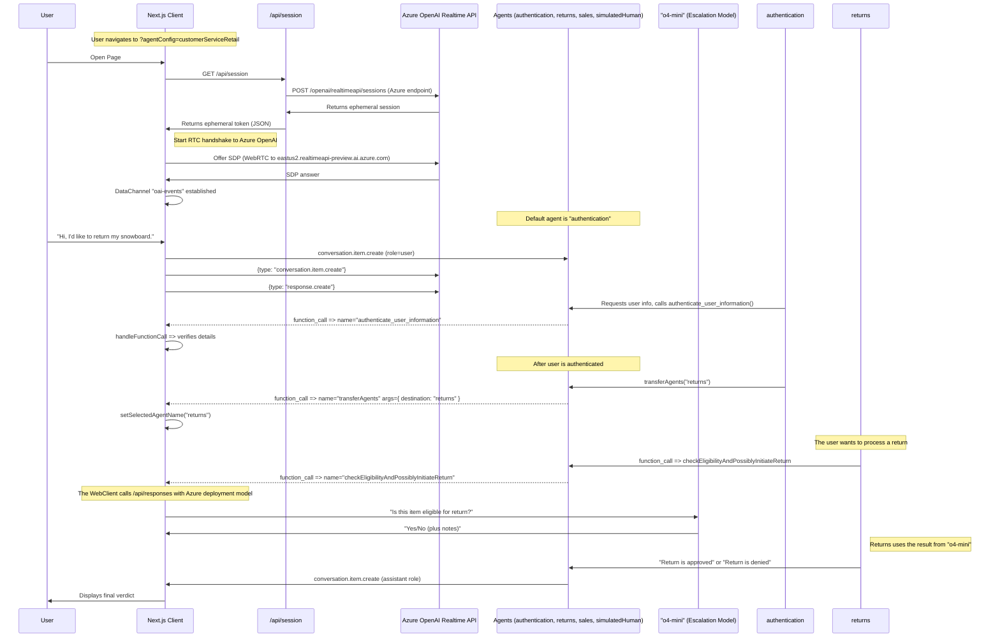

# Azure OpenAI Realtime API Agents Demo

This is a demonstration of advanced patterns for voice agents, adapted to work with **Azure OpenAI Realtime API** and the OpenAI Agents SDK. This version maintains full compatibility with Azure OpenAI services while providing the same advanced agentic patterns.

**NOTE:** This is based on the [openai-realtime-agents](https://github.com/openai/openai-realtime-agents) repository but modified for Azure OpenAI compatibility.

There is one main pattern demonstrated:
1. **Sequential Handoff:** Specialized agents (powered by Azure OpenAI realtime api) transfer the user between them to handle specific user intents. This is great for customer service, where user intents can be handled sequentially by specialist models that excel in specific domains. This helps avoid the model having all instructions and tools in a single agent, which can degrade performance.

## Setup

- This is a Next.js typescript app. Install dependencies with `npm i`.
- **Azure OpenAI Configuration**: Add your Azure OpenAI credentials to your environment:
  ```bash
  AZURE_OPENAI_API_KEY=your_azure_openai_api_key
  AZURE_OPENAI_ENDPOINT=https://your-resource-name.openai.azure.com/
  AZURE_OPENAI_API_VERSION=2025-04-01-preview
  AZURE_OPENAI_DEPLOYMENT=gpt-4.1  # Your deployment name for text completions
  ```
  You can either add these to your `.bash_profile` or copy `.env.sample` to `.env` and add them there.
- Start the server with `npm run dev`
- Open your browser to [http://localhost:3000](http://localhost:3000). It will default to the `simpleHandoff` Agent Config.
- You can change examples via the "Scenario" dropdown in the top right.

## Azure OpenAI Models

This demo uses the following Azure OpenAI models:
- **Realtime Model**: `gpt-4o-mini-realtime-preview` for voice interactions
- **Text Completion**: Your deployed model (specified in `AZURE_OPENAI_DEPLOYMENT`) for guardrails and complex reasoning
- **Transcription**: `whisper-1` for audio transcription

## Available Scenarios

1. **Simple Handoff**: Basic agent transfer demonstration between a greeter and haiku writer
2. **Customer Service Retail**: Complex multi-agent customer service flow with authentication, returns, and sales agents

# Agentic Pattern: Sequential Handoffs

This pattern is inspired by [OpenAI Swarm](https://github.com/openai/swarm) and involves the sequential handoff of a user between specialized agents. Handoffs are decided by the model and coordinated via tool calls, and possible handoffs are defined explicitly in an agent graph. A handoff triggers a session.update event with new instructions and tools. This pattern is effective for handling a variety of user intents with specialist agents, each of which might have long instructions and numerous tools.

Here's a [video walkthrough](https://x.com/OpenAIDevs/status/1880306081517432936) showing how it works. You should be able to use this repo to prototype your own multi-agent realtime voice app in less than 20 minutes!


*In this simple example, the user is transferred from a greeter agent to a haiku agent. See below for the simple, full configuration of this flow.*

Configuration in `src/app/agentConfigs/simpleHandoff.ts`
```typescript
import { RealtimeAgent } from '@openai/agents/realtime';

// Define agents using the OpenAI Agents SDK
export const haikuWriterAgent = new RealtimeAgent({
  name: 'haikuWriter',
  handoffDescription: 'Agent that writes haikus.', // Context for the agent_transfer tool
  instructions:
    'Ask the user for a topic, then reply with a haiku about that topic.',
  tools: [],
  handoffs: [],
});

export const greeterAgent = new RealtimeAgent({
  name: 'greeter',
  handoffDescription: 'Agent that greets the user.',
  instructions:
    "Please greet the user and ask them if they'd like a haiku. If yes, hand off to the 'haikuWriter' agent.",
  tools: [],
  handoffs: [haikuWriterAgent], // Define which agents this agent can hand off to
});

// An Agent Set is just an array of the agents that participate in the scenario
export default [greeterAgent, haikuWriterAgent];
```
## CustomerServiceRetail Flow

This is a more complex, representative implementation that illustrates a customer service flow, with the following features:
- A more complex agent graph with agents for user authentication, returns, sales, and a placeholder human agent for escalations.
- An escalation by the [returns](https://github.com/openai/openai-realtime-agents/blob/60f4effc50a539b19b2f1fa4c38846086b58c295/src/app/agentConfigs/customerServiceRetail/returns.ts#L233) agent to `o4-mini` to validate and initiate a return, as an example high-stakes decision, using a similar pattern to the above.
- Prompting models to follow a state machine, for example to accurately collect things like names and phone numbers with confirmation character by character to authenticate a user.
  - To test this flow, say that you'd like to return your snowboard and go through the necessary prompts!

Configuration in [src/app/agentConfigs/customerServiceRetail/index.ts](src/app/agentConfigs/customerServiceRetail/index.ts).
```javascript
import authentication from "./authentication";
import returns from "./returns";
import sales from "./sales";
import simulatedHuman from "./simulatedHuman";
import { injectTransferTools } from "../utils";

authentication.downstreamAgents = [returns, sales, simulatedHuman];
returns.downstreamAgents = [authentication, sales, simulatedHuman];
sales.downstreamAgents = [authentication, returns, simulatedHuman];
simulatedHuman.downstreamAgents = [authentication, returns, sales];

const agents = injectTransferTools([
  authentication,
  returns,
  sales,
  simulatedHuman,
]);

export default agents;
```

## Schematic

This diagram illustrates a more advanced interaction flow defined in `src/app/agentConfigs/customerServiceRetail/`, including detailed events.

<details>
<summary><strong>Show CustomerServiceRetail Flow Diagram</strong></summary>



</details>

# Azure OpenAI Integration

## Key Differences from Standard OpenAI

This implementation is specifically adapted for Azure OpenAI services:

### **Endpoints**
- **Session API**: `https://your-resource.openai.azure.com/openai/realtimeapi/sessions`
- **WebRTC**: `https://eastus2.realtimeapi-preview.ai.azure.com/v1/realtimertc`
- **Text Completions**: Uses your Azure OpenAI deployment via `/api/responses`

### **Authentication**
- Uses `AZURE_OPENAI_API_KEY` instead of `OPENAI_API_KEY`
- Requires Azure-specific endpoint and API version configuration
- Supports Azure OpenAI deployment model names

### **Models Used**
- **Realtime**: `gpt-4o-mini-realtime-preview` (Azure OpenAI)
- **Text**: Your Azure deployment model (configurable)
- **Transcription**: `whisper-1` (supported on Azure)

### **Architecture Updates**
- Modern React hooks-based architecture (`useRealtimeSession`, `useHandleSessionHistory`)
- Enhanced audio codec support with browser compatibility fallbacks
- Improved session management and error handling
- Better TypeScript integration

## Browser Compatibility

Enhanced MediaRecorder support with automatic fallbacks:
- **Chrome/Edge**: `audio/webm;codecs=opus` (best quality)
- **Firefox**: `audio/ogg;codecs=opus`
- **Safari**: `audio/mp4` fallback
- **Universal**: `audio/wav` as final fallback

# Other Info
## Next Steps
- You can copy these templates to make your own multi-agent voice app! Once you make a new agent set config, add it to `src/app/agentConfigs/index.ts` and you should be able to select it in the UI in the "Scenario" dropdown menu.
- Each agentConfig can define instructions, tools, and toolLogic. By default all tool calls simply return `True`, unless you define the toolLogic, which will run your specific tool logic and return an object to the conversation (e.g. for retrieved RAG context).
- If you want help creating your own prompt using the conventions shown in customerServiceRetail, including defining a state machine, we've included a metaprompt [here](src/app/agentConfigs/voiceAgentMetaprompt.txt), or you can use our [Voice Agent Metaprompter GPT](https://chatgpt.com/g/g-678865c9fb5c81918fa28699735dd08e-voice-agent-metaprompt-gpt)

## Output Guardrails
Assistant messages are checked for safety and compliance before they are shown in the UI.  The guardrail call now lives directly inside `src/app/App.tsx`: when a `response.text.delta` stream starts we mark the message as **IN_PROGRESS**, and once the server emits `guardrail_tripped` or `response.done` we mark the message as **FAIL** or **PASS** respectively.  If you want to change how moderation is triggered or displayed, search for `guardrail_tripped` inside `App.tsx` and tweak the logic there.

## Navigating the UI
- You can select agent scenarios in the Scenario dropdown, and automatically switch to a specific agent with the Agent dropdown.
- The conversation transcript is on the left, including tool calls, tool call responses, and agent changes. Click to expand non-message elements.
- The event log is on the right, showing both client and server events. Click to see the full payload.
- On the bottom, you can disconnect, toggle between automated voice-activity detection or PTT, turn off audio playback, and toggle logs.

## Pull Requests

Feel free to open an issue or pull request and we'll do our best to review it. The spirit of this repo is to demonstrate the core logic for new agentic flows; PRs that go beyond this core scope will likely not be merged.

# Credits

## Original OpenAI Realtime Agents
This project is based on the [openai-realtime-agents](https://github.com/openai/openai-realtime-agents) repository.

**Original Contributors:**
- Noah MacCallum - [noahmacca](https://x.com/noahmacca)
- Ilan Bigio - [ibigio](https://github.com/ibigio)
- Brian Fioca - [bfioca](https://github.com/bfioca)

## Azure OpenAI Adaptation
- Adapted for Azure OpenAI compatibility with modern hooks architecture
- Enhanced browser compatibility and error handling
- Updated to latest OpenAI Agents SDK (`@openai/agents ^0.0.5`)
